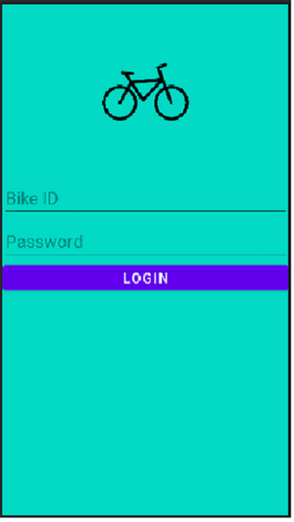
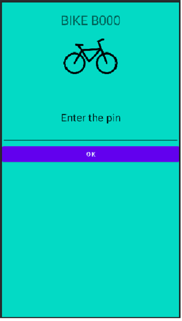
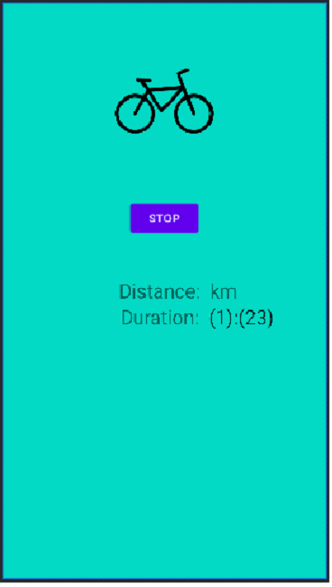

# RentalBike
Android App for Bike in Project BikeVerleih

For security, the bike must send its last location to the server after a specified time. The central task of the rental bike application is to send the PIN code entered by the customer. Upon the positive response from the server, the lock is decrypted. During the ride, the application calculates the distance traveled. At the end of the trip the server is then informed

 Login layout

 Main layout

 Rent layout
